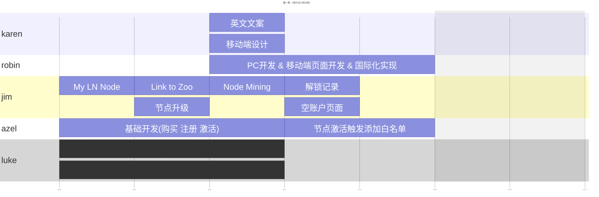
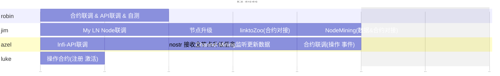
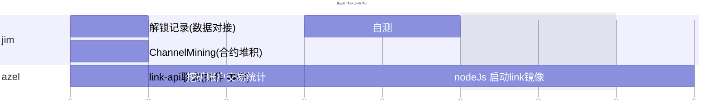

## 任务计划

### 第一周（3月24日-3月28日）

```mermaid
gantt
    title 第一周：3月24日-3月28日
    dateFormat YYYY-MM-DD
    axisFormat %m-%d
    tickInterval 1day
    excludes saturday,sunday
    
    %%{init: { 'gantt': {'barHeight': 140, 'barGap': 20, 'topPadding': 100, 'rightPadding': 60, 'leftPadding': 450, 'gridLineStartPadding': 80, 'useWidth': 4500, 'fontFamily': 'Arial, sans-serif', 'fontSize': 64, 'numberSectionStyles': 5, 'displayMode': 'compact', 'axisWidth': 220, 'columnWidth': 120, 'dayWidth': 4000, 'sectionFontSize': 64} } }%%
    
    section karen
    英文文案            :2025-03-26, 1d
    移动端设计          :2025-03-26, 1d
    
    section robin
    PC开发 & 移动端页面开发 & 国际化实现           :2025-03-26, 3d
    
    section jim
    My LN Node          :2025-03-24, 1d
    Link to Zoo          :2025-03-25, 0.5d
    节点升级          :2025-03-25, 0.5d
    Node Mining          :2025-03-26, 1d
    解锁记录          :2025-03-27, 0.5d
    空账户页面          :2025-03-27, 0.5d
    
    section azel
    基础开发(购买 注册 激活)            :2025-03-24, 3d
    节点激活触发添加白名单      :2025-03-27, 2d
    
    section luke
    查询合约(购买 注册 激活)      :2025-03-24, 3d
    查询合约(购买 注册 激活)      :2025-03-24, 3d
```

### 第二周（3月31日-4月4日）

```mermaid
gantt
    title 第二周：3月31日-4月4日
    dateFormat YYYY-MM-DD
    axisFormat %m-%d
    tickInterval 1day
    excludes saturday,sunday
    
    %%{init: { 'gantt': {'barHeight': 140, 'barGap': 20, 'topPadding': 100, 'rightPadding': 60, 'leftPadding': 450, 'gridLineStartPadding': 80, 'useWidth': 5500, 'fontFamily': 'Arial, sans-serif', 'fontSize': 64, 'numberSectionStyles': 5, 'displayMode': 'compact', 'axisWidth': 220, 'columnWidth': 120, 'dayWidth': 4000, 'sectionFontSize': 64, 'todayMarker': 'off', 'taskMode': { 'done': { 'barColor': '#aaa' }, 'active': { 'barColor': '#aaa' }, 'crit0': { 'barColor': '#aaa' }, 'crit1': { 'barColor': '#aaa' }, 'crit2': { 'barColor': '#aaa' }, 'crit3': { 'barColor': '#aaa' }, 'default': { 'barColor': '#aaa' }} } } }%%
    
    section robin
    合约联调 & API联调 & 自测                     :2025-03-31, 2d

    section jim
    My LN Node联调          :2025-03-31, 2d
    节点升级              :2025-04-02, 1d    
    linktoZoo(合约对接)              :2025-04-03, 0.5d                 
    NodeMining(数据&合约对接)             :2025-04-04, 0.5d
    
    section azel
    lnfi-API联调             :2025-03-31, 1d
    nostr 接收全节点升级信息       :2025-04-01, 1d
    Channel Mining监听更新数据       :2025-04-02, 2d
    合约联调(操作 事件)       :2025-04-04, 1d
    
    section luke
    操作合约(注册 激活)             :2025-03-31, 1d
```

### 第三周（4月7日-4月11日）

```mermaid
gantt
    title 第三周：4月7日-4月11日
    dateFormat YYYY-MM-DD
    axisFormat %m-%d
    tickInterval 1day
    excludes saturday,sunday
    
    %%{init: { 'gantt': {'barHeight': 140, 'barGap': 20, 'topPadding': 100, 'rightPadding': 60, 'leftPadding': 450, 'gridLineStartPadding': 80, 'useWidth': 4500, 'fontFamily': 'Arial, sans-serif', 'fontSize': 64, 'numberSectionStyles': 5, 'displayMode': 'compact', 'axisWidth': 220, 'columnWidth': 120, 'dayWidth': 4000, 'sectionFontSize': 64} } }%%
    
    section jim
    解锁记录(数据对接)             :2025-04-07, 1d     
    ChannelMining(合约堆积)             :2025-04-07, 1d     
    自测             :2025-04-10, 2d   

    section azel
    link-api联调(操作 事件)       :2025-04-07, 1d
    挖矿账户交易统计             :2025-04-08, 2d
    nodeJs 启动link镜像             :2025-04-10, 3d
```
